Sans l’indication mentionnant GNURadio, je n’aurais jamais trouvé cet outil indispensable. Mais j'ai beaucoup tâtonné quand même…
# Mauvaise direction
Une soft radio, ça semblait cool pour simuler une radio et ma première idée a été d'essayer d’y reconstruire la HF pour ré-hétérodyner ensuite chaque canal avec la fréquence adaptée. Il faut méchamment sur-échantillonner pour y arriver mais j'ai ainsi pu "voir" (virtuellement) le signal HF à 2,4GHz. Un peu un rêve qu'aucun oscilloscope n'aurais pu me tracer. Sauf que dans ce signal, la modulation FM ne se distingue plus à l'œil. C'est logique en fait mais je n'avais jamais vraiment pris conscience de ce phénomène. L’hétérodynage réalise une translation des fréquences et l’excursion de fréquence (Δ*f*) de la FM n’est donc pas modifiée au passage. Le même Δ*f* d’environ 200kHz qui est visible à l’œil sur un signal à 1MHz devient imperceptible sur un signal à 2,4GHz.  
La modulation FM se retrouve dans la capture. Inutile d’aller la rejouer à 2,4GHz.  
Mauvaise direction donc. Une soft radio fait plus que simuler une radio classique.  
Mais avant de voir pourquoi, un petit mot sur hétérody-quoi ?
# Hétérodynage ??
La radio ça passe sur des signaux HF et ils ne sont pas simples à traiter. L’astuce de l’hétérodynage, c’est de remarquer que ces signaux sont des sinusoïdes (ou presque) et qu’il existe une formule de trigo magique : cos(*a*) x cos(*b*) = 0,5 cos(*a*+*b*) + 0,5 cos(*a*-*b*).  
Disons que vous vous intéressez à un signal HF, c’est cos(*a*). Vous le mélangez avez un signal de fréquence proche, c’est cos(*b*). Vous obtenez une superposition de deux signaux :
* 0,5 cos(*a*+*b*) qu’il est facile d’enlever en le filtrant car il est en HF,
* 0,5 cos (*a*-*b*) qui est exploitable car *a*-*b* est petit puisque *b* est proche de *a*.

Quasiment toutes les radios ont un  étage d’entrée qui fait cela.  
Note : ici *a* c’est 2𝝅*ft*.
# Une soft radio = I/Q, là c’est vraiment cool
Ce qui est vraiment cool avec une soft radio, c’est que dans ses ‘fils’ passent des signaux I/Q c’est à dire des grandeurs complexes et que ces signaux permettent de “voir” le signe des fréquences. C'est à dire que là, -*f* et *f* donnent des signaux distincts alors qu'en signal classique, ils seraient indiscernables et donc non séparables car repliés l’un sur l’autre. Comme d'observer le mouvement vertical d'un bouchon qui flotte sur la houle ne permet pas de savoir si elle va vers la droite ou vers la gauche.  
Comment se fait la distinction de signe en I/Q ?
* *f* > 0 : I s’observe en avance sur Q,
* *f* < 0 : I est en retard sur Q.

Un peu comme si on avait deux bouchons.  
Une des conséquences de l'existence des fréquences négatives, c’est qu’en I/Q un échantillonnage sans filtre anti-repliement ne produit justement pas réellement de repliement !!!  
Car un échantillonnage sans filtre produit en fait une série de fréquences images fantômes du signal original qui sont ses translatées, en plus ou en moins, d’un multiple de la fréquence d'échantillonnage. En signal classique, les fréquences fantômes qui sont négatives sont repliées d’où ce phénomène de repliement alors qu’en I/Q elles ne le sont pas.  
Les anglo-saxons appellent *aliasing* l’apparition des signaux fantômes et *folding* le phénomène de repliement. Nous, on mélange un peu les deux en parlant toujours que de repliement.  
Et l’hétérodynage en I/Q ?  
La formule de trigo magique devient encore plus magique : e<sup>*a*</sup> x e<sup>-*b*</sup> = e<sup>*a*-*b*</sup>. Vous n’avez même plus le terme en *a*+*b* à filtrer !!! (ici *a* = 2*i*𝝅*ft*).  
Notez que le passage à des signaux I/Q n’est pas gratuit. À taux d’échantillonnage identique, le I/Q est deux fois plus volumineux que le classique car il y a I et il y a Q.
# Bon venons en au BLE…
Les spécifications nous apprennent qu’il y a 40 canaux HF numérotés de 0 à 39 et espacés tout les 2MHz de 2,402GHz à 2,480GHz.  
On y voit aussi que les canaux d’annonce sont les numéros 0 (2,402GHz), 12 (2,426GHz) et 39 (2,480GHz).  
L’hétérodynage à 2,461GHz lors de la capture les a translatés de -2,461GHz et nous les retrouvons donc à -59MHz, -35MHz et 19MHz. Remarquez les 2 fréquences négatives que je garde comme telles car nous sommes en I/Q !!  
S'il était activé, le fameux filtre anti-fantôme enlèverait ces 3 fréquences car elles sont toutes en dehors de la bande exploitable de l'échantillonnage 20MHz qui est de -10MHz à 10MHz. D'où l'astuce de le désactiver.  
Nous aurons donc les fameuses images fantômes c'est à dire les translatées, en plus ou en moins, d’un multiple de 20MHz. Mais nous ne verrons que les fantômes qui se retrouvent dans la bande -10MHz à 10MHz.  
* Pour le canal 0, nous verrons son image fantôme à 1MHz, c’est à dire -59MHz + 3 x 20MHz,
* Pour le canal 12, nous verrons son image à 5MHz c’est à dire -35MHz + 2 x 20MHz,
* Pour le canal 39, nous verrons son image à -1MHz c’est à dire 19MHz - 1 x 20MHz.

Nous avons trois signaux à des fréquences distinctes. Ouf ! Sans I/Q, -1MHz serait repliée sur 1MHz.  
Il est temps d’utiliser GNU Radio pour voir si nous observons bien ces 3 fréquences dans la capture.
# La chute d’eau
On avait l’indication du flow graph à utiliser au début dans GNU Radio :  
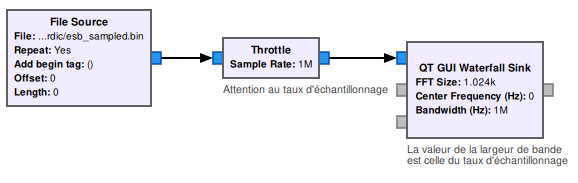  
Notez les poignées bleues qui signalent le mode complexe propre  au I/Q.  
On obtenait ceci :  
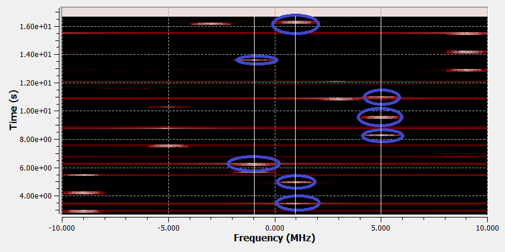  
Nous voyons bien les canaux d’annonce qui nous intéressent mais il y en a plein d’autres. Ce sont les autres canaux BLE, nous pouvons les ignorer car on nous a dit de chercher dans les canaux d’annonce. Mais même sur -1GHz, 1GHz et 5GHz tout n’est pas à prendre car d’autres canaux ont aussi leurs images fantômes là. Par exemple, le canal 2 tombe aussi sur 5GHz.  
Alors, comment savoir ?
# Un tour dans le temporel
Ce flow graph nous produit un fichier son avec le contenu de ble.sig :  
  
Pour quoi faire ? Pour l’ouvrir dans audacity :  
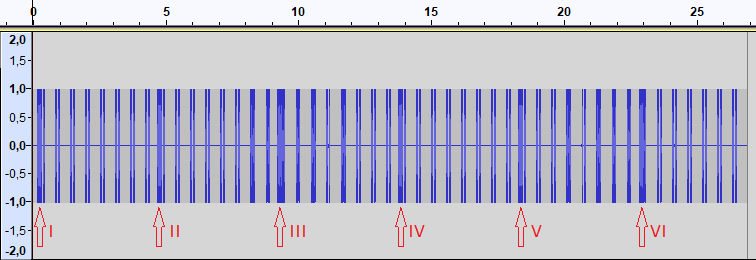  
Nous y voyons assez clairement 6 trames plus longues que les autres. Il semble logique de se focaliser dessus. Nous pouvons relever le début et la fin de chacune mesurés en nombre d’échantillons (environ) et aussi les retrouver dans la chute d’eau pour avoir leurs fréquences :
* I : 6000 -> 16000 (1MHz, probablement canal 0),
* II :206000 -> 216000 (5MHz, probablement canal 12),
* III : 408000 -> 413500 (-1MHz, probablement canal 39),
* IV : 606000 -> 616500 (1MHz, probablement canal 0),
* V : 805000 -> 816500 (5MHz, probablement canal 12),
* VI : 1006000 -> 1016500 (-1MHz, probablement canal 39),

De retour dans GNU Radio, ce flow graph va nous permettre de sélectionner la fenêtre temporelle d’une des 6 trames :  
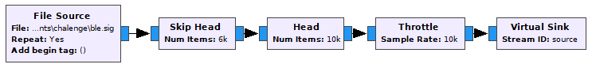  
Par exemple pour avoir la fenêtre IV :
* skip head = 606000
* head = 616500 - 606000 = 10500.

# La bande de base
Là où un signal embarque de l’information, c’est dans la façon dont il s’écarte de sa fréquence centrale du fait de la modulation quelle qu’en soit la nature. C’est ce qu’on appelle son spectre. Pour extraire cette information, le plus simple est de le translater en fréquence pour le centrer sur 0. Carrément ! Ce que l’on obtient alors s’appelle la bande de base.  
Comment fait-on ? Hétérodynage, encore ! On le mélange à un signal pur de fréquence égale à la translation que l’on souhaite. Par exemple, pour ramener en bande de base un signal à 1MHz, on le mélange avec un signal pur à -1MHz :   
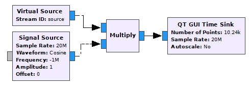  
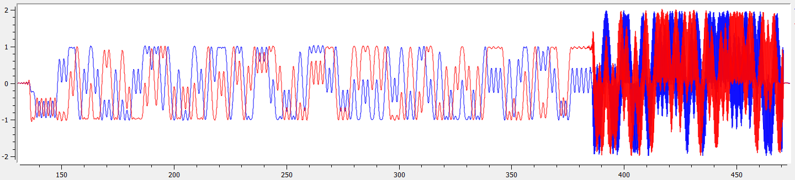  
C’est beau au début mais moche à la fin. C’est un autre signal à une autre fréquence qui se superpose. Il faut l’enlever en filtrant.  
Note : ce serait une mauvaise idée de centrer à 0 des signaux classiques (non I/Q) car le côté à gauche de 0 serait replié sur le côté positif et mélangé avec.
# Donc filtrons
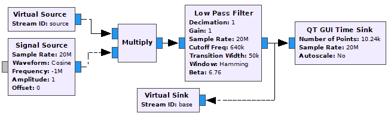  
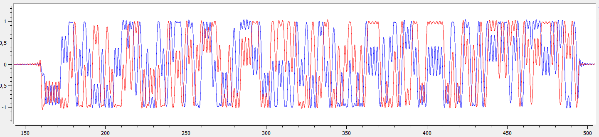  
La voilà la bande de base.
# Oui, mais on veut des bits !
Les spécifications de BLE nous disent que la modulation employée est GFSK, et Wikipédia nous apprend qu’il s’agit d’une modulation de fréquence à transitions douces. En signal, on n’aime pas les transitions brutales.  
Le 1 est codé par une excursion Δ*f* > 0 et le 0 par Δ*f*  < 0. Là encore, merci I et merci Q car un signal replié nous aurait inversé ces correspondances.  
Bref, il faut démoduler la FM. J’ai d’abord tenté la PLL pour ça mais oublions bien vite. Il y a aussi un démodulateur GFSK dans GNU radio mais je n’ai pas réussi à l’utiliser. Le bon bloc c’est le **démodulateur quadratique**. Il est simple, il  n’a qu’un seul paramètre, son gain. Mais vous verrez qu’il produit du bruit en l’absence de signal. Il faut mieux le rendre muet en l’absence de signal. Ce qui nous donne :  
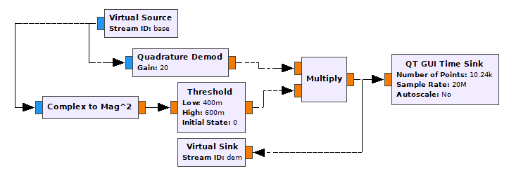  
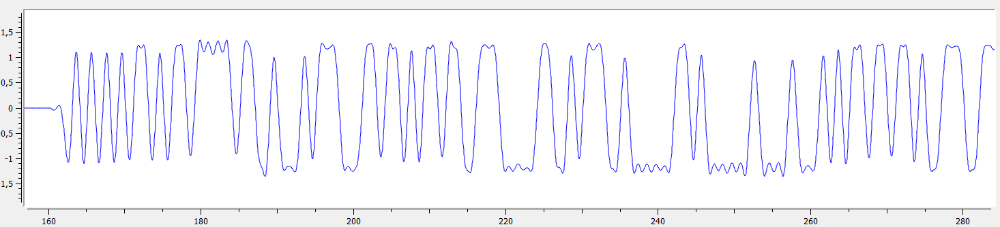  
On distingue bien des bits là.  
Note : une autre magie du I/Q au passage. Le module donne l’amplitude. En classique, obtenir l’amplitude du signal ou son carré, comme le fait ici le bloc *Complex to Mag^2*, n’est pas aussi simple.
# Mais on veut de vrais bits avec un flag dedans !
Le débit du BLE de base est 1Mb/s et sachant que l'échantillonnage est fait à 20MHz, on trouve facilement qu’il y a 20 échantillons pour chaque bit. Il faut regrouper les 20 échantillons qui compose un bit en un seul échantillon. Un bloc intégrateur avec décimation réglée sur 20 fait ce travail en ajoutant les échantillons par paquets de 20 pour n’en former qu’un seul. Il y a une difficulté à s’assurer que chaque paquet sera bien constitué de 20 échantillons d’un même bit et pas un mélange à cheval sur 2 bits successifs. C’est un problème de synchronisation d’horloge. J’ajoute un délai et je tâtonne en le faisant varier entre 0 et 19 pour synchroniser à la main. C’est pas très critique comme réglage :  
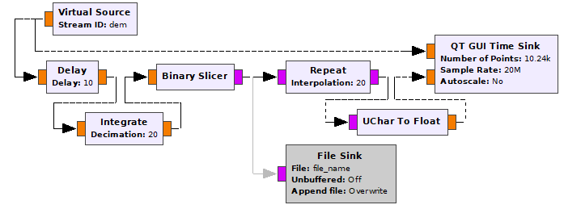  
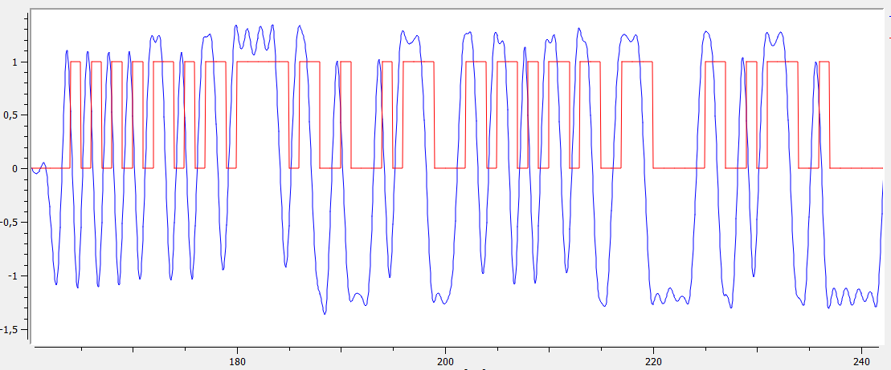  
Nous avons enfin un fichier avec nos bits dedans. Enfin, c’est plus exactement une succession d’octets à 0x00 ou 0x01.  
Reste à le faire pour chacune des 6 trames repérées auparavant en adaptant à chaque fois la fréquence hétérodyne.  
Non, ce n’est pas vrai, dès que j’ai eu la première j’ai regardé tout de suite ce qu’elle avait dans le ventre sans faire les autres. Mais pour cela il faut regrouper les bits en octets.
# À la recherche des octets
Nous avons une succession constante de 1 avant que le signal ne commence. Donc je cherche le premier octet significatif en attendant son LSB en premier, comme le précisent les specs.  
Je reconnais enfin 0xAA = 0b10101010 et ça c’est l’un des deux préambules du BLE. Mais, l’autre étant 0x55 = 0b01010101 j’ai aussi ce préambule possible si je décale d’un petit bit supplémentaire.  
Ce qui lève l'ambiguïté c’est la suite car en callant sur le préambule 0xAA, j’observe ensuite 0xD6 0xBE 0x89 0x8E et ça, comme nous l’apprennent aussi les specs, c’est l’**access address** réservée pour les signaux d’annonce. Cela ne peut pas être un hasard et nous sommes donc sur la bonne voie, la charge utile devrait suivre.  
Mais ça devient pénible de lire une succession de 0x00 et 0x01 qui devraient être des 0 et des 1. Il faut commencer à coder pour rendre cela plus lisible. Moi, c’est encore en C# que je suis le plus efficace. Ça vous semble bizarre ? À moi aussi.

```C#
public byte[] ToBytes(byte[] input, int skip)
{
    int size = (input.Length - skip) / 8;
    List<byte> output = new List<byte>();
    for (int i = 0; i < size; i++)
    {
        byte b = 0;
        for (var j = 0; j < 8; j++)
        {
            if (input[skip + 8 * i + j] == 0x01)
            {
                b |= (byte)(0b1 << j);
            }
        }
        output.Add(b);
    }
    return output.ToArray();
}
```

Enfin de vrais octets. Vite, ça donne quoi en ASCII ?
Ben..., rien de lisible !  
En plus, d’après les specs, je devrais avoir la longueur des datas de la charge utile donnée par le septième octet. Il m’en annonce 206 alors que j’en ai que 30 au mieux.  
C’était trop beau. J’ai pas du bien les lire, ces specs.
# Il faut dé-blanchir
Retour dans les specs du BLE. En fait, la charge utile est blanchie, entête et CRC compris, avant  d’être intégrée dans la trame transmise. Charge pour le récepteur de les dé-blanchir à l’arrivée. Il faut s’y coller aussi.  
Blanchir c’est inverser certains bits choisis d’après une séquence pseudo-aléatoire. Le but n’est pas de crypter. La séquence pseudo-aléatoire n’est pas secrète. C’est pour ajouter des transitions dans le signal même lorsque les datas ont des séquences un peu longues de 0 ou de 1 successifs. Les transitions aident le récepteur à se synchroniser.  
Dé-blanchir, c’est refaire la même opération que blanchir car c’est une involution. À condition, bien sûr, de travailler avec la même séquence pseudo-aléatoire des deux côtés.  
Les specs expliquent bien comment sont générées ces séquences. C’est toujours le même algo mais avec une graine d’initialisation qui dépend du canal. Il y a donc 40 séquences différentes. L’attaque brutale serait possible mais comme nous avons identifié le canal de chacune des 6 trames, on devrait trouver à coup sûr.  
Ben là encore, pas si simple.
# L’index de canal
Il faut bien les lire, les specs. Et bien voir qu’il y a une subtilité dans la numérotation des canaux. Il y a les numéros de canal, de 0 à 39, et les index de canal, de 0 à 39 aussi. Mais ils ne se correspondent pas simplement. Allez savoir pour quelle raison. Pour ne retenir que les 3 qui nous intéressent, nous avons :
* canal 0 -> index 37,
* canal 12 -> index 38,
* canal 39 -> index 39

Tiens, pour 39 ça colle. Ça aurait été sympa de nous mettre celui là dans la première trame.  
C'est l'index qui permet de calculer la graine.  
Toujours en c#, désolé, ça donne :  
```C#
class dewhite
{
    protected byte reg;
    public dewhite(byte RFchannel)
    {
        reg = (byte)(mapChannel(RFchannel) | 0b1000000);
    }
    protected byte mapChannel(byte RFchannel)
    {
        if (RFchannel == 0)
            return 37;
        else if (RFchannel <= 11)
            return (byte)(RFchannel - 1);
        else if (RFchannel == 12)
            return 38;
        else if (RFchannel <= 38)
            return (byte)(RFchannel - 2);
        else return 39;
    }
    protected byte step()
    {
        byte nreg = (byte)(reg >> 1);
        if((reg & 0b1) == 0)
        {
            reg = nreg;
            return 0;
        }
        else
        {
            nreg |= 0b1000000;
            if ((nreg & 0b100) == 0)
                nreg = (byte)(nreg | 0b100);
            else
                nreg = (byte)(nreg & 0b11111011);
            reg = nreg;
            return 1;
        }
    }
    protected byte read()
    {
        byte b = 0;
        for (var i =0; i < 8; i++)
        {
            byte bit = step();
            if (bit == 1)
                b |= (byte)(0b1 << i);
        }
        return b;
    }
    protected byte transformOne(byte b)
    {
        return (byte)(read() ^ b);
    }
    public byte[] transform(byte[] input, int skip = 5)
    {
        int len = input.Count() - skip;
        if (len < 0) throw new Exception("dewhite error");
        byte[] output = new byte[len];
        for (int i = 0; i < len; i++)
        {
            output[i] = transformOne(input[i + skip]);
        }
        return output;
    }
}
```
# Le flag !
Les trames donnent les messages suivants :
* I : Continue à chercher
* II : Essaye encore
* III : Presque!
* IV : FCSC{e1fb6540b123f3deb3
* V : 684834e8319f65285e1c60e
* VI : 8813d501fc31ea9447ed414}


# Conclusion
25 ans que je n'avais pas fait de signal. Les candidats qualifiables n'étaient eux même pas nés.  
Un vrai bonheur de se replonger dedans.


```python

```
